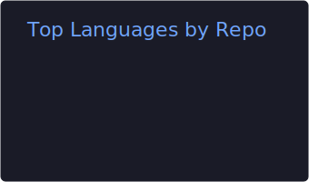
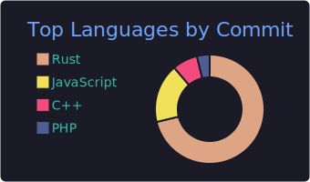
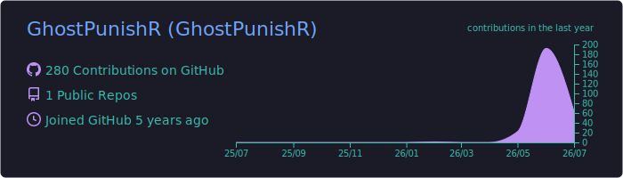
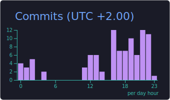
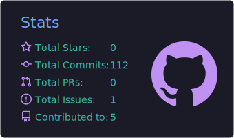

## Statistiques GitHub

<table>
  <tr>
    <td align="center">
      
    </td>
    <td align="center">
      
    </td>
  </tr>
  <tr>
    <td colspan="2" align="center">
      
    </td>
  </tr>
</table>

---

## Activité

  

---

## Résumé du profil

  
  

  

  
  

